# Financial Research Agent - LangGraph Architecture

## Overview

This document describes the architecture for a **Financial Research Agent** built using:

- **Backend:** LangGraph + OpenAI
- **Frontend:** Gradio
- **Search:** DuckDuckGo Search
- **Memory:** LangGraph Thread Memory

The agent can:

- Retrieve stock market information
- Analyze financial news and sentiment
- Calculate investment risk metrics
- Support stock purchase workflows
- Request human approval before executing critical actions like purchasing stocks

---

## Workflow Diagram



---

## Agent State

The shared graph state stores information exchanged between nodes throughout the workflow.

```python
from typing import TypedDict, List, Dict, Any

class AgentState(TypedDict):
    messages: List
    ...
    ...
```

### State Fields

| Field | Description |
|---------|-------------|
| `messages` | Conversation history |

Add if more needed

---

## Graph Structure

```text
START
  │
  ▼
Supervisor Agent
  │
  ▼
Route Request
 ├── Stock Flow
 ├── News Flow
 └── Purchase Stock Flow
      │
      ▼
Tool Execution
      │
      ▼
Processing Layer
      │
      ▼
State Updater
      │
      ▼
Response Synthesizer
      │
      ▼
Human Approval Gate
      │
      ├── revise  → Response Synthesizer
      └── approve → END
```

---

# Nodes

## 1. Supervisor Agent

### Purpose

The Supervisor Agent acts as the entry point of the graph.

Responsibilities:

- Understand user intent
- Determine required workflows
- Route requests to appropriate agents

### Example Output

```json
{
  "route": ["stocks", "news"]
}
```

---

## 2. Router (Conditional Edge)

Routes requests to the correct workflow based on the supervisor's decision.

```python
graph.add_conditional_edges(
    "supervisor",
    route_request,
    {
        "stocks": "stock_fetcher",
        "news": "news_sentiment",
        "buy": "purchase_stock",
    }
)
```

### Available Routes

| Route | Destination |
|---------|------------|
| `stocks` | Stock Fetcher Agent |
| `news` | News Sentiment Agent |
| `buy` | Purchase Stock Agent |

---

## Stock Analysis Flow

### 3. Stock Fetcher Agent

Responsible for collecting stock market information.

### Data Sources

- Alpha Vantage
- Yahoo Finance
- Polygon.io

### Responsibilities

Fetch:

- Current price
- Market capitalization
- P/E ratio
- Trading volume
- Foreign exchange rates

### Example

```python
def stock_fetcher(state: AgentState):
    ...
```

---

### 4. Stock Tool Node

Executes stock-related tools.

```python
stock_tools = ToolNode([
    get_stock_price,
    get_pe_ratio,
    get_volume,
    get_fx_rate
])
```

### Updates State

```python
state["stock_data"]
```

### Example Output

```json
{
  "price": 220.12,
  "market_cap": "3.2T",
  "pe_ratio": 35.8,
  "volume": 85000000,
  "fx_rate": 1.09
}
```

---

### 5. Risk Calculator

Calculates investment risk metrics using stock data.

### Inputs

```python
state["stock_data"]
```

### Metrics

- Volatility
- Sharpe Ratio
- Maximum Drawdown
- Overall Risk Level

### Example

```python
def risk_calculator(state: AgentState):
    ...
```

### Updates State

```python
state["risk_score"]
```

### Example Output

```json
{
  "volatility": 0.18,
  "sharpe_ratio": 1.25,
  "drawdown": 0.12,
  "risk_level": "Medium"
}
```

---

## News Analysis Flow

### 6. News Sentiment Agent

Responsible for gathering financial news and determining market sentiment.

### Data Sources

- Tavily Search
- News API
- DuckDuckGo Search

### Example

```python
def news_agent(state: AgentState):
    ...
```

---

### 7. News Tool Node

Executes news-related tools.

```python
news_tools = ToolNode([
    search_headlines,
    sentiment_analysis
])
```

### Updates State

```python
state["news_results"]
```

### Example Output

```json
{
  "headlines": [
    "Company reports record earnings",
    "Analysts upgrade stock outlook"
  ],
  "sentiment": "positive"
}
```

---

## Purchase Stock Flow

### Purchase Stock Agent

Handles stock purchasing requests.

Responsibilities:

- Validate ticker symbol
- Verify risk assessment
- Confirm purchase details
- Trigger human approval workflow
- Execute trade after approval

---

## Processing Layer

Combines outputs from:

- Stock Analysis Flow
- Risk Calculator
- News Analysis Flow

Responsibilities:

- Aggregate results
- Resolve conflicts
- Prepare data for final response generation

---

## State Updater

Centralized node responsible for:

- Updating graph state
- Persisting intermediate results
- Tracking tool execution history

---

## Response Synthesizer

Generates the final response presented to the user.

Responsibilities:

- Summarize stock analysis
- Include sentiment insights
- Present risk assessment
- Generate actionable recommendations

### Updates State

```python
state["final_response"]
```

---

## Human Approval Gate

Provides human-in-the-loop validation before executing sensitive actions.

### Actions

#### Approve

```text
approve → END
```

Continue workflow execution.

#### Revise

```text
revise → Response Synthesizer
```

Request modifications and regenerate response.

---

# Search Configuration

Use DuckDuckGo as an additional search provider.

```python
from langchain_community.tools import DuckDuckGoSearchRun

search_tool = DuckDuckGoSearchRun(
    region="us-en"
)
```

---

# Memory Management

Use LangGraph Thread Memory to maintain conversation context across interactions. Use SQlite

### Benefits

- Persistent conversation history
- Multi-turn stock analysis
- User preference retention
- Context-aware recommendations

---

# Technology Stack

## Backend

- LangGraph
- LangChain
- OpenAI

## Frontend

- Gradio

## Data Providers

- Alpha Vantage
- Yahoo Finance
- Polygon.io
- Tavily Search
- News API
- DuckDuckGo Search

---

# Expected End-to-End Flow

1. User submits a financial query.
2. Supervisor Agent identifies intent.
3. Router selects relevant workflows.
4. Stock and/or News agents execute tools.
5. Risk Calculator evaluates investment risk.
6. Processing Layer aggregates results.
7. State Updater persists outputs.
8. Response Synthesizer generates recommendations.
9. Human Approval Gate reviews critical actions.
10. Approved response is returned to the user.


# Reference
Use gh command to clone this repo: https://github.com/HussainHaider/omnichat. Take inspritaion for tool and strucutre

## Readme.
Create a readme after all the implementation